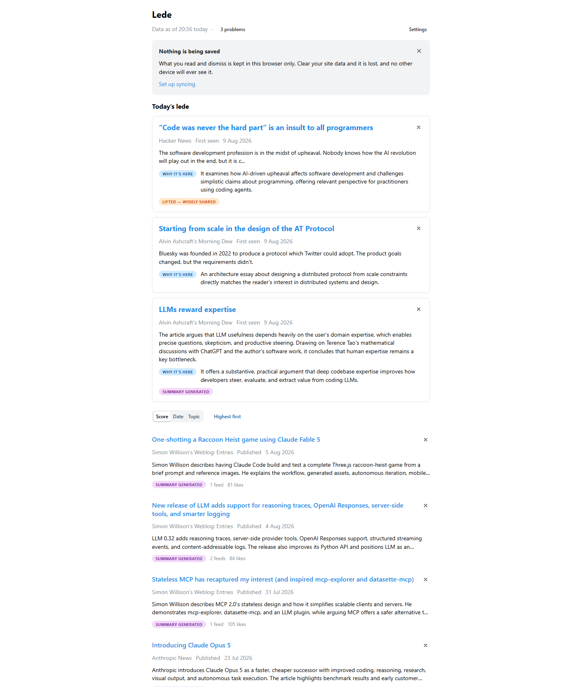

# Lede

Lede is a personal dev and tech news page. Once a night it reads a set of feeds, drops what you've said you don't want, summarises and grades what's left against your own written interest profile, and publishes a single page for you to read in the morning.

Open it at **https://mgreuel.github.io/lede/**.

1. **The masthead.** One line tells you when the data is from — "Data as of 20:36 today", or an absolute date once it's more than 36 hours old, so staleness is never ambiguous. A "· N problems" marker appears next to it only when something went wrong overnight; a healthy night shows nothing. Click it and a panel expands in place: which sources answered, anything wrong with your configuration, and how many articles couldn't be graded. Nothing is ever pushed at you — no banners, no toasts to dismiss. Once you've hidden anything, a count and a **Show hidden** toggle appear here too.
2. **The local-only notice.** Shown once, until you dismiss it, if your reading state is being kept in this browser alone. **Set up syncing** takes you straight to the settings panel.
3. **Today's lede.** Three hero picks, drawn from everything unread across the whole 30-day window rather than just today, so a good article you haven't seen isn't buried by newer ones. They hold a fixed slot: re-sorting the index never moves them. Picks are the only place **Why it's here** appears — the model's own reason — so you can tell whether it understood why you'd care. A **Lifted** badge means an article was promoted a grade because it's being widely shared.
4. **Sorting.** Score, Date or Topic, with the direction beside it.
5. **The index.** Everything else, below the picks. Each row carries its summary clamped to two lines, where it came from, the date, the author, and how much attention it's getting elsewhere. Nothing is hidden from you by the editorial choice.
6. **Settings**, top right. Where you turn on syncing your reading state between devices — see below.

## Reading the index

- A summary written for you is labelled **Summary generated**, so you always know whose words you're reading.
- An article that arrived with nothing but a headline is shown with no summary at all, rather than an invented one. You are never misled by a confabulation.
- Popularity is shown as raw numbers per source — Hacker News points and comments, how many feeds carried it, Bluesky likes — never as one blended score, so you can judge what kind of attention it got. *Never measured* looks different from *measured and ignored*: you never read silence as a verdict.
- Sort by score, by date, or group by topic. Score and date sort both ways. Score is the default. Sorting is for this visit only — it isn't remembered, and reloading resets it.

## Read and dismissed

- Opening an article counts as reading it. There's no bookkeeping to do.
- Each row has a dismiss button for something graded too highly.
- Either way the row disappears at once and an undo toast appears at the bottom. A mis-tap costs nothing.
- Hidden is never lost. The masthead's count and **Show hidden** bring them back.
- Two empty states, told apart: a genuinely quiet day reads differently from a day you've finished.

## Reading state across devices

By default everything stays in this browser. No account, no setup, nothing to configure — trying the site costs nothing.

Turn on sync and your reading history follows you between laptop and phone, so you never triage the same article twice.

The articles are public, but what you read is nobody's business. So your reading history is kept in a private repository that belongs to you — not in this one, and not on any server of ours. There is no server; the site is a set of static files.

Sync needs two things: a private repository you own, and a fine-grained access token scoped to that one repository — narrower than a normal login, and pasted once. There's no login flow to sit through.

The settings panel walks you through both steps.

## Everywhere else

Light, dark and system colour schemes are all respected, and the site works on a phone.
